# Overview: <b>Audio Tool</b>

That tool is a solution for managing all the audio of the project without programming at any time.

- We have created the definitive Unity audio management tool.

- With it you can forget about the code to add your audio tracks to your game.

- The main thing is that you can easily set all the audio for your project, and configure it.

- You can automatically set events and subscribe them to the tracks too.

<b>AUDIO TOOL</b> is made up of two great components, <b>Audio Manager</b> for configuring all the mixers and tracks. And <b>Audio Player</b>, which gives you the option to subscribe to any event of your scripts, or even to create it without the need for code at any time.

We have developed a graphical interface, in which without programming, you can easily add tracks and mixers. The tool itself is responsible for automatically generating the necessary audio sources.

This component gives you the option to subscribe any event that you have at any script into the actual GameObject, or even to create those events without having to code at any time.


# Getting Started

Welcome to the Audio Tool documentation in which you can learn how to 
implement this tool into your project and save a lot of your time.

For a better understanding we have prepared a test scene inside the 
package so that you can see for yourself what it is capable of and how easy 
it is to manage the audio of a project.

Go to the package folder, open the Tests folder, and at the Testing Scene 
folder you can find the test scene. Open it.

Now take a look at the hierarchy. As you can see you have two empty 
objects previously created for this tutorial. The Audio Management and the 
Object.

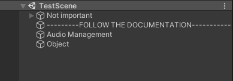

The first step is to configure the audio of the project so you are going to 
need the AudioManager component.

## Audio Manager

Add the component to the Audio Management object.

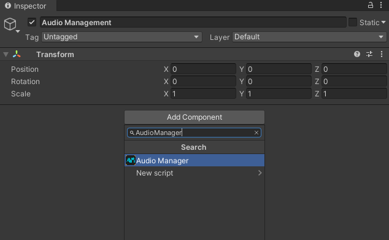

The first look of the component is like this. When you’ve added the 
component now you can configure all the tracks that you want for your 
project.

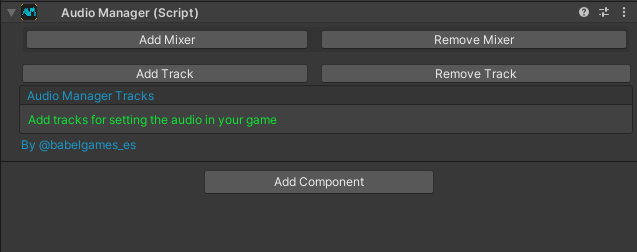

In our case, we are going to add four tracks. But first, we need to add the 
mixers.

If you don’t know how to add mixers, please check the unity documentation 
or watch our demo video at the asset store.

We already created one for this tutorial (located at the 
Tests\Runtime\AudioTests as Mixer) so you don’t need to create it if you 
don’t want to.

So, let’s set our audio. First add two mixers, open them and put at the mixer 
references the created groups (Music and Fx).

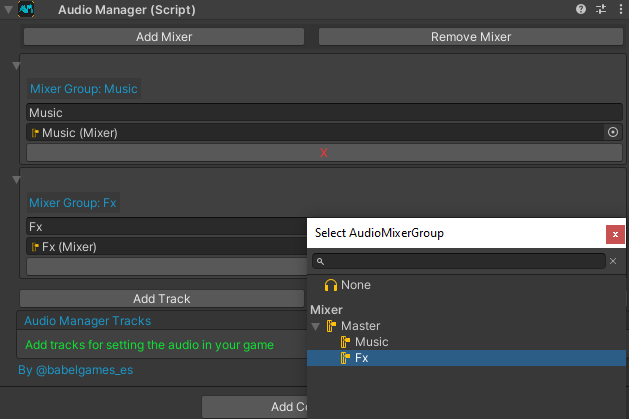

You can see that when you put the mixer in the reference the group takes
the name. That’s for use in that list as a reference for the next configuration 
at the tracks.

You can remove any mixer by the remove button (delete the last reference 
at the list) or by the X button (deleting the actual mixer reference).

Once you have all the mixers setted, now you can add the first track. Add 
the track and open it.

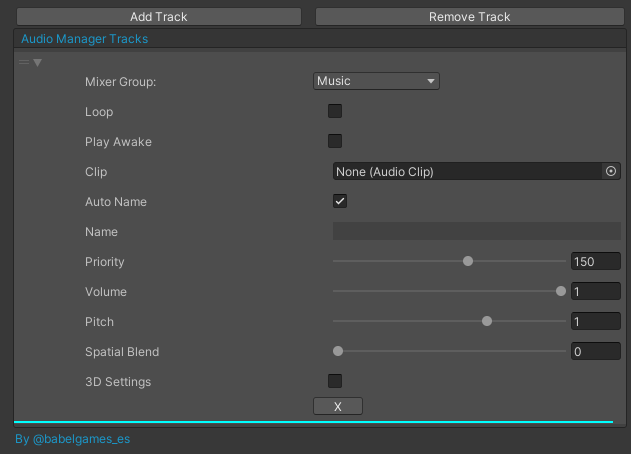

As you can see, there are plenty of fields that you can configure. All these 
fields will be passed to an audio source at the start of the game.

- The first step is to set the mixer, so select the mixer that you 
previously referenced in the mixer list. For the first one we are going 
to select the Music mixer.

    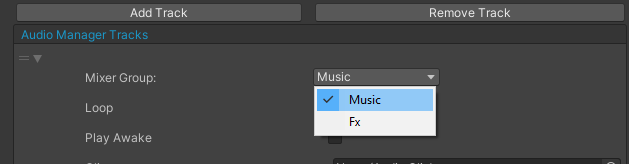

- Then you can see two toggles for loop the audio, and for playing it in 
the awake. For this track we only want to set the loop.

    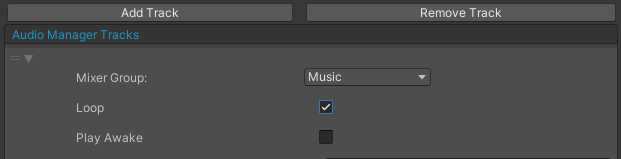

- Now you can set the audio clip for the track. Select the one whose 
name is MusicX (All the clips are in the
Tests\Runtime\AudioTests\Clips directory).

    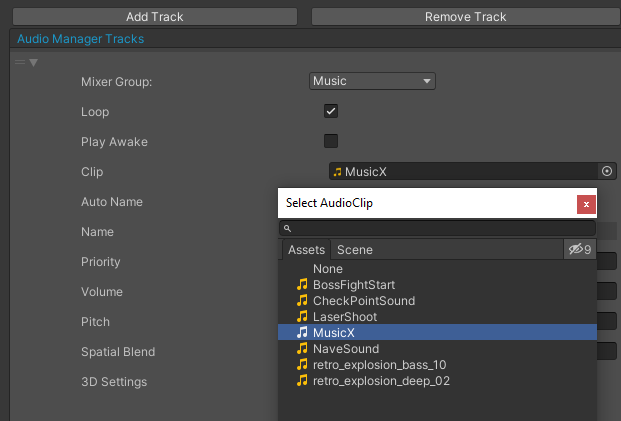

- For find the clip and play it later with the other component you need 
a name so you can name it by your own by unchecking the auto name 
field, or you can leave the tool to automatically name the track with 
the clip name (if the name already exists the tool add a prefix to the 
name by using the alphabet and giving 3 random words).

    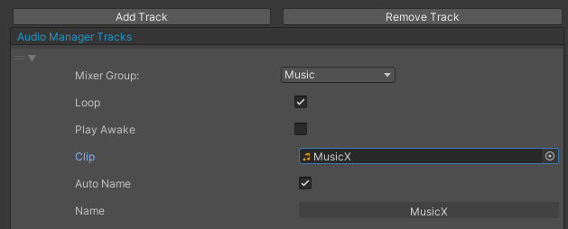

    **IF THE NAME IS THE SAME**

    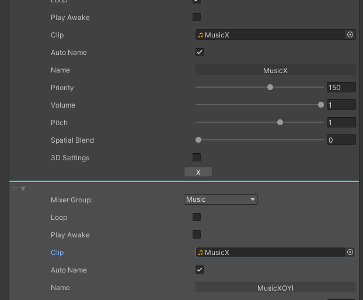

- Now you have some basic fields like the priority, volume and the 
pitch, set them as you want.

    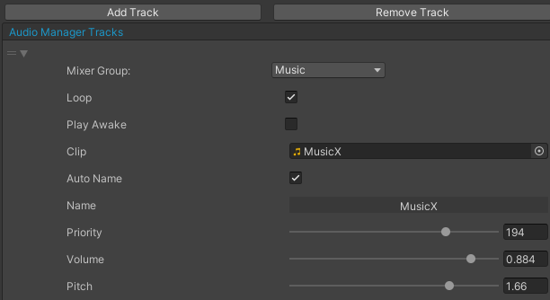

- Now you have the option to make the track a 3D track. 
Just check the 3D Settings field and you would see the object 
reference in which you want to create the audio source, and the min 
and max distance of the audio. You have to set the Spatial Blend field 
to 1 too.

    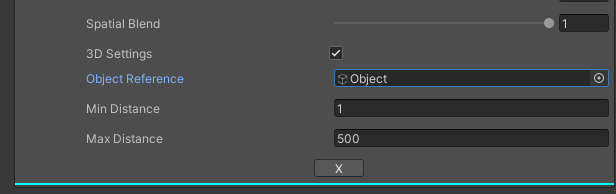


Now set 3 more clips as Fx without loop and without 3D settings in the same 
way.

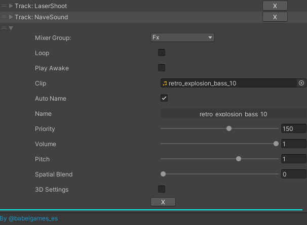

Notice that you can reorder the list of tracks if you want for greater 
organization. Just click at the three bars at the left of the track and drag it 
to the position that you want.

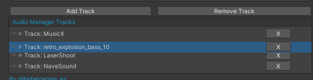

If you want to remove tracks you have the remove button for removing the 
last one at the track list, or you can use the X button for removing the actual 
track (both open and close).

With all the tracks configured, now you can start with the other component 
of the Audio Tool.

## Audio Player

First, add the Audio Player component to the Object at the scene.

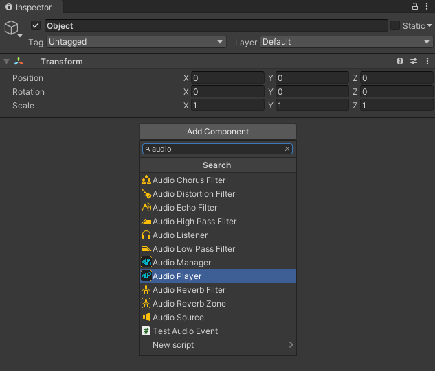

This is the first look of the component.

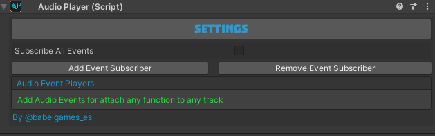

### <b>Manual Event Creation</b>

Now you have two options:

- You can add an audio event player to subscribe any event (at any 
script attached into the actual GameObject) to the play method 
(searching the track by the name, and play it when the event is 
invoked).

   1) First add the audio event subscriber.

   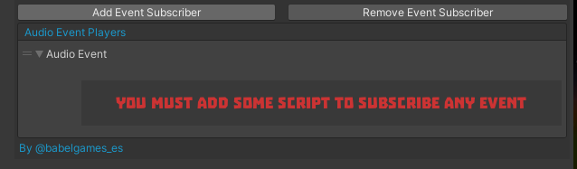

   2) Now add the script in which you have the events. For this 
      example, you are going to learn how to declare and invoke an 
      event, so add the testAudioEvent script and open the script.

      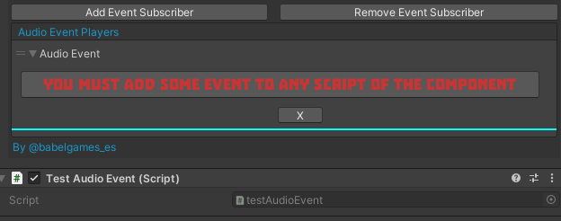

      First create the event (we are going to create an event for the music track):
      ``` C#
      public event Action<string> someEvent;
      ```
      
      Then invoke the event in the method that you want:
      ``` C#
      private void SomeMethod()
      {
            someEvent?.Invoke("MusicX");
      }
      ```
        - Create the event and invoke it at the start method.

        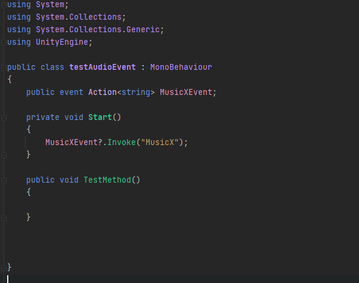

        **Notice that you need the system namespace for declare events**

        - Then you can return to the AudioPlayer component and select 
        the event you want to subscribe at the audio event subscriber 
        (For subscribe events one by one). The power of that tool is 
        that it will find all the matches events at all the scripts attached 
        to the actual GameObject.

        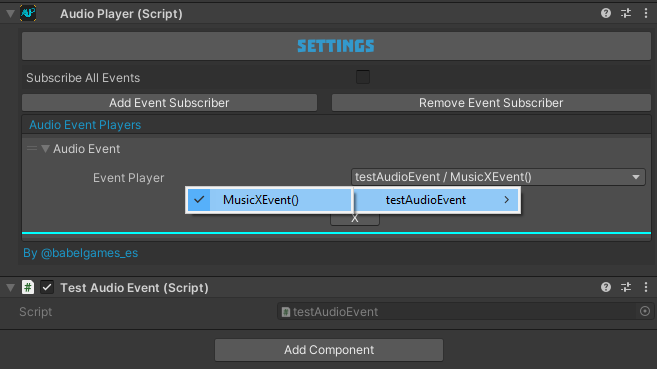

- The other option is that you can check the "Subscribe All Events" 
option for subscribe all the events that the component founds at any 
script attached into the actual GameObject (Only matches the event 
with this structure: ``` Action<string>``` )

    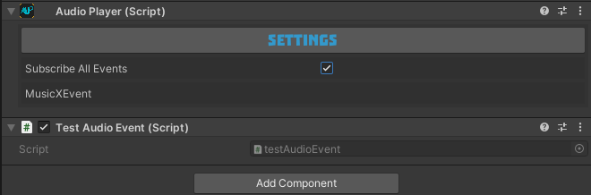

By using any of these options you must create and invoke the events on
your own.

You have another option.

### <b>Automatic Event Creation</b>

To get access to this implementation, open the settings window by clicking 
at the SETTINGS button.

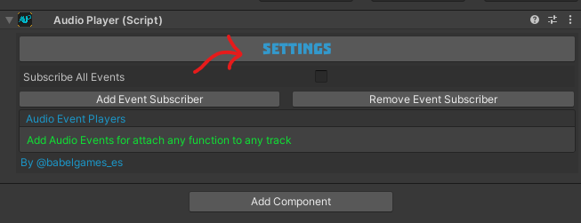

Check the Automatic Invoking option, for use the Automatic Event Creation.

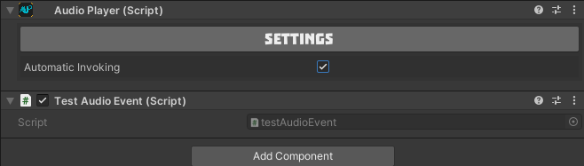

Once you check it, now you can close the settings window by clicking again 
at the same button.

With this implementation the component takes all the information of the 
track and the event and overwrites the selected script at the actual 
GameObject with the newest events.

Close the settings window and take a look at the Event Creator window.

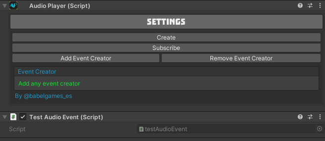

Now you can add Event Creators for each event that you want to create and 
subscribe to any script into the actual GameObject.

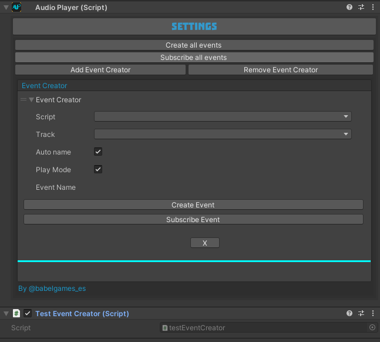

For this part of the tutorial, we are going to add another test script called 
testEventCreator.

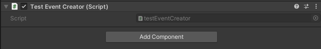

Now we are going to create all the events for the Fx tracks previously 
configured at the AudioManager component.

- First select the script in which you want to create the events.

    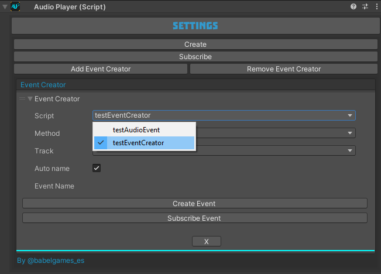

- Now select the method in which you want to create the invoke of the 
event (the track would sound when the method is called).

    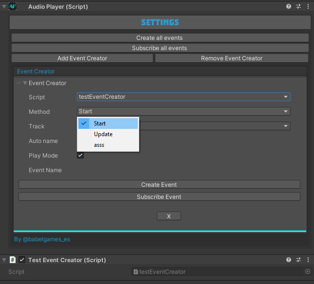

- Finally, you have to select the track that you want to play at the 
event. You can leave the component to automatically name the event 
as [track name + Event], or you can name it on your own by 
unchecking the Auto name field.

    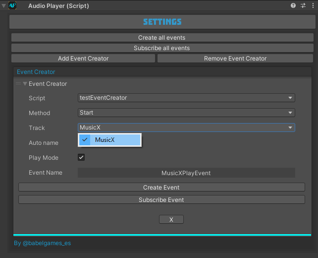

You can now create this event by using the Create Event button which 
creates the actual event, or the Create button which creates all the events 
of the list.

A warning message like this will appear, but do not be alarmed because we 
have overwritten the script and have reworked the assets folder.

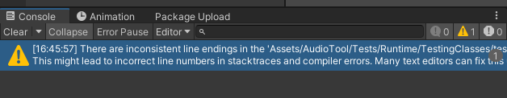

Just clear the console and check that everything is correct in the script.

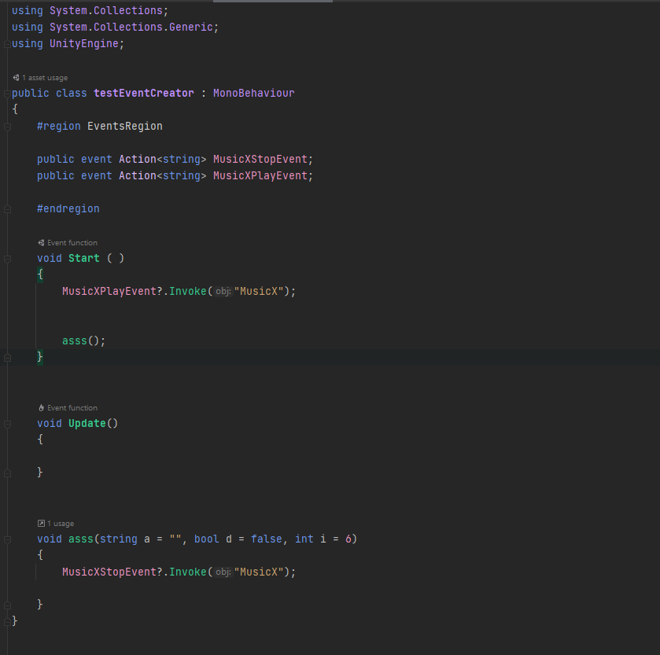

As you can see all is good, now you can see the real power of this tool. You 
can manage all the audio of the project without programming at any time.

Now with that done, it’s time to subscribe to this event, so click at the 
Subscribe Event button for subscribe the actual event or in the Create 
button for subscribe all. 

A message will appear with information of the event subscribed and a 
confirmation that the subscription has been successfully completed.

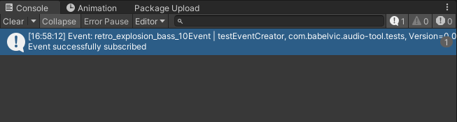

But you don’t have to trust in me, test it by playing the game and check that 
the subscribed event is played correctly. 

If you want to test the other 
implementation, remember that you have to return to the other window 
and select the event or subscribe to all the events.

Notice when you play the game that the audio sources will be setted at the 
object with the AudioManager component (Which implements a singleton 
pattern to persist between scenes), or at the object referenced in the 3D 
Settings.

Don’t destroy on load because of the singleton pattern.

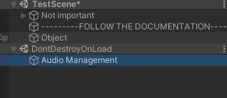

The sources with 2D configuration.

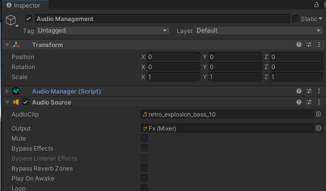

The sources with 3D configuration at the object referenced.

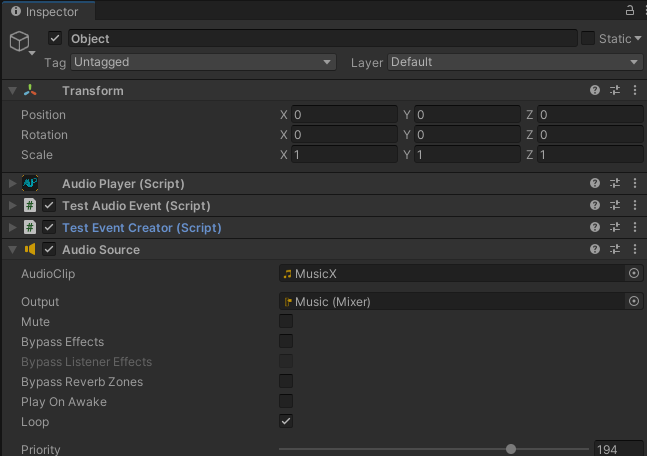

Another incredible feature of the automatic event creation is that you can 
have a method with parameters or with invocations or with comments with 
the same name before the method, but the component will find the method 
anyways.

Like in that case:

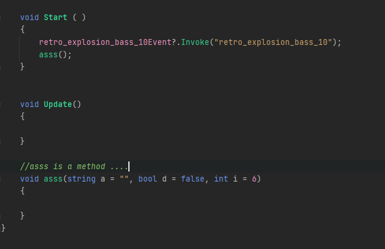

For the test, we are going to create the other events of the Fx sounds 
at the asss method of the same testEventCreator script.

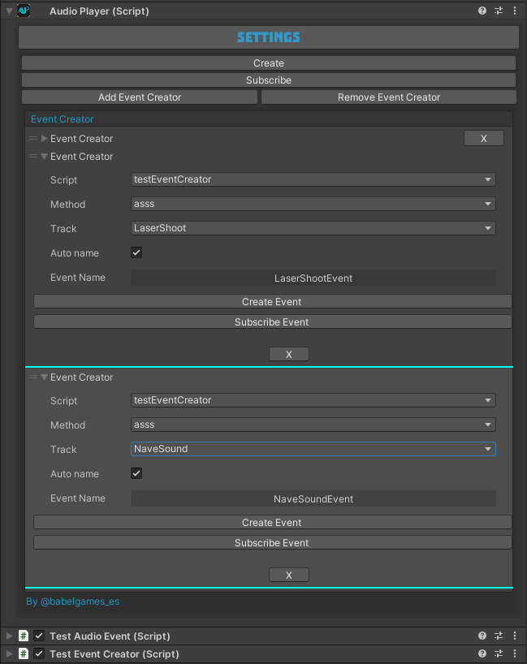

Test the Create button, it would create only the events that don’t
already exist at the selected script. As you can see all the events are 
created correctly.

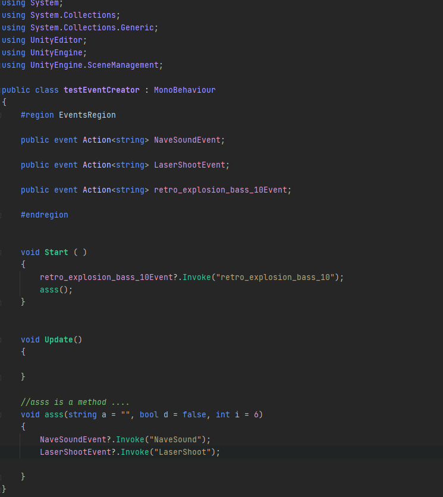

And subscribe them all too with the Subscribe button.

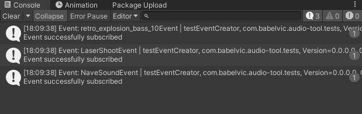

That's all for now, now enjoy the tool :)