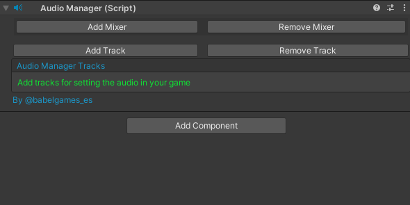

# Audio Tool
That tool is a solution for managing all the audio of the project without programming.<br>

The main thing is that you can set all the audio, and configure it with the Audio Manager component.<br>

You have the Audio Player component too, for set events and subscribe them to the tracks.

# Audio Manager



This is the first look when you add the componente. Now you can start by adding an audio mixer group to the list or an audio track for setting the project audio.

## Adding the mixer

You have to create a new mixer group in unity before add it to the manager.


Then Add all the groups that you want to have in the project.

 


And now you can set these groups into the audio manager.


You only have to select the audio mixer group that you want. 
The component takes the name and set it into a popup for select the mixer that you want for each track.


## Adding the tracks

When you set all the mixers, now you can start adding the tracks for the project.


Now you can set all the fields that you want for each track. 
The more important field is the clip.
When you set the clip you can see that the name is autocomplete by the clip name (if the name already exists the name add a prefix AAA using the alphabet).
You can set the name too by unchecking the auto name field.

If you want to set the audio with 3D options set the spatial blend to 1 and check the 3D Settings field.


Set any object in the scene that you want to have the audio at the Object Reference field.


Take this as an example of a track all setted.

# Audio Player

This component gives you the option to subscrive any event that you have at any script into the actual GameObject, or even to create those events without having to code at any time.


Add the component to the GameObject that has the script with the events, or in which you want to create them.


This is the first view of the Audio Player.

You have two options now. 

 - You can add an audio event palyer to subscribe any event (at any script   attached into the actual GameObject) to the play method (searching the track by the name, and play it when the event is invoke).

   

 - You can check the "Subscribe All Events" option for subscrve all the events that the component founds at any script attached into the actual GameObject (Only matches the event with this structure: ``` Action<string> ```)

   


 Using any of these options you must create the event, and invoking it by your own.

First create the event:
``` C#
public event Action<string> SomeAction;
```

Then invoke the event in the method that you want:
``` C#
public void SomeMethod(){
    SomeAction?.Invoke("#NameOfTheTrack#");
}
```

## Automatic Event Creation

You have another option. If you check the automatic invoking option at the settings window of the component you can create all the events of the project without coding at any time.


Now you can add Event Creators for each event that you want to subscribe at any script into the actual GameObject.


- First select the script attached to the actual GameObject.

- Now you can select any method of the script selected to create invoke of the event.

- Lastly you have to select the track that you want to play with the event. You can leave the component to auto name automatically the event as [track name + Event].

When you have all the setting done you can create the event one by one, or all at once.

The result is a region at the top of the script for all the declarations of the events, and the invoking into the selected methods.


That's all for now, now enjoy the tool :)